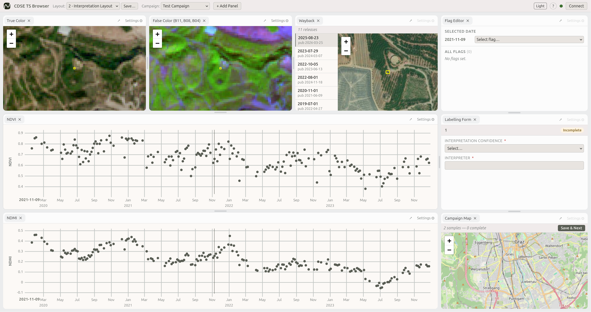
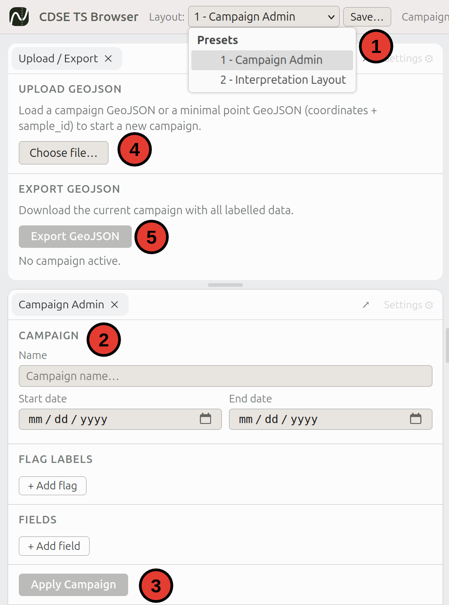

#  Planetary Computer Time-series Browser

This project aims to make labelling of Sentinel-2 time-series easily accessible by taking advantage of Microsoft Planetary Computer.

The design goals of the project are the following:

- **VIEWING**: Make sharing of time-series interpretation as easy as possible
- **LABELING**: Enable basic labelling of time-series without any local data wrangling
- **MODIFYING**: Hackable, free, open source and fully local: Every laballing campaign has different needs, so make modification and self-hosting easily possible




## Usage & Prerequisites

You can use the interface at https://label.nadir.earth

No Sentinel Hub or Copernicus credentials are required. Pick a point, a time-frame and "Open In Browser"; the app searches Planetary Computer STAC and samples Sentinel-2 L2A values through the Planetary Computer TiTiler endpoint.

## Modes

The interface offers different conceptual usage modes.

1. Viewing mode
2. Campaign mode

Sampled points for both modes can be shared by simply sharing the current URL. 

This is an example for a simple point in "viewing mode":

https://label.nadir.earth/?lon=12.492657&lat=46.769982&start=2021-03-29&end=2026-03-29&selected=2022-11-09

All the viewing parameters can be read directly from the URL, latitude, longitude, start and end of the time-series. `selected` is the date which is shown as a satellite image. This point is a point with spruce forest in Austria, the selected date is when the first signs of bark beetle decay appear.

Now an example for a point in "campaign mode" [here](https://label.nadir.earth/?lon=17.501370&lat=52.084176&start=2015-01-01&end=2024-12-31&selected=2017-08-21&sample=%7B%22sample_id%22%3A3541%2C%22flags%22%3A%7B%222017-07-22%22%3A%22110%22%2C%222017-08-21%22%3A%22243%22%2C%222018-04-06%22%3A%22222%22%2C%222018-06-07%22%3A%22120%22%2C%222024-11-25%22%3A%22120%22%2C%222015-07-11%22%3A%22110%22%7D%2C%22confidence%22%3A%22high%22%2C%22comment%22%3A%22Clear+Windthrow%22%7D&schema=%7B%22campaign%22%3A%22DISFOR%22%2C%22flagLabels%22%3A%7B%22100%22%3A%22Healthy+Vegetation%22%2C%22110%22%3A%22Undisturbed+Forest%22%2C%22120%22%3A%22Revegetation%22%2C%22220%22%3A%22Salvage%22%2C%22221%22%3A%22After+Biotic+Disturbance%22%2C%22222%22%3A%22After+Abiotic+Disturbance%22%2C%22240%22%3A%22Abiotic%22%2C%22243%22%3A%22Wind%22%7D%2C%22fields%22%3A%5B%7B%22key%22%3A%22sample_id%22%2C%22label%22%3A%22Sample+ID%22%2C%22type%22%3A%22display%22%2C%22required%22%3Atrue%2C%22session_persistent%22%3Afalse%7D%2C%7B%22key%22%3A%22confidence%22%2C%22label%22%3A%22Confidence%22%2C%22type%22%3A%22select%22%2C%22options%22%3A%5B%22high%22%2C%22medium%22%2C%22low%22%5D%2C%22required%22%3Atrue%2C%22session_persistent%22%3Afalse%7D%2C%7B%22key%22%3A%22comment%22%2C%22label%22%3A%22Comment%22%2C%22type%22%3A%22text%22%2C%22required%22%3Afalse%2C%22session_persistent%22%3Afalse%7D%5D%7D).

Written out and nicely formatted, the URL looks like this:

<details><summary>See Full URL</summary>

```
https://label.nadir.earth/?lon=17.501370
&lat=52.084176
&start=2015-01-01
&end=2024-12-31
&selected=2024-07-03
&sample={
    "sample_id":3541,
    "flags":{
        "2017-07-22":"110",
        "2017-08-21":"243",
        "2018-04-06":"222",
        "2018-06-07":"120",
        "2024-11-25":"120",
        "2015-07-11":"110"
    },
    "confidence":"high",
    "comment":"Clear Windthrow"}
&schema={
    "campaign":"DISFOR",
    "flagLabels":{
        "100":"Healthy+Vegetation",
        "110":"Undisturbed+Forest",
        "120":"Revegetation",
        "220":"Salvage",
        "221":"After+Biotic+Disturbance",
        "222":"After+Abiotic+Disturbance",
        "240":"Abiotic",
        "243":"Wind"
    },
    "fields":[
        {
            "key":"sample_id",
            "label":"Sample+ID",
            "type":"display",
            "required":true,
            "session_persistent":false
        },
        {
            "key":"confidence",
            "label":"Confidence",
            "type":"select",
            "options":["high", "medium", "low"],
            "required":true,
            "session_persistent":false
        },
        {
            "key":"comment",
            "label":"Comment",
            "type":"text",
            "required":false,
            "session_persistent":false
        }
    ]
}
```

</details>

Here you can see a few of the additional features a labelling campaign offers:

- Named label flags (Code: Description)
- Metadata fields, which can be set by the user. 

However the main part a labelling campaign offers is the ability to define many points which can then be navigated between and labelled one after another. However since this is a lot of data to share, all the other points also in the labelling campaign can not be shared just via a URL. Instead, a special labelling campaign object needs to be created, which can then be shared as a file.

We go through how you can create a labelling campaign yourself next.

### Creating a labelling campaign 

The basic requirement to create a new labelling campaign is a geojson file with point geometries (at the moment no other geometries are supported) and a column called `sample_id`" where each point is assigned a unique ID.

Here's a very basic example of a valid geojson file:

<details><summary>See Example GeoJSON</summary>

```
{
    "type": "FeatureCollection",
    "features": [
        {
            "type": "Feature",
            "geometry": {
                "type": "Point",
                "coordinates": [
                    -4.122119320177979,
                    36.741785367381176
                ]
            },
            "properties": {
                "sample_id": 0
            }
        },
        {
            "type": "Feature",
            "geometry": {
                "type": "Point",
                "coordinates": [
                    -4.121614665341534,
                    36.74231320914648
                ]
            },
            "properties": {
                "sample_id": 1
            }
        }
    ]
}
```

</details>

See also: [assets/raw_samples.geojson](assets/raw_samples.geojson). This file can be created in any mainstream GIS application.

Once you have a file with all the points which will need to be labelled, you can import it into the labelling interface to add additional fields which need to be collected and to assign flags to be set within the time-series.



1. Select the "Campaign Admin" layout preset
3. Add campaign name, start and end of the time-series to label, any codes and flag mappings as well as metadata fields the labellers need to fill out per sample.
4. Apply those changes
2. Now upload your prepared GeoJSON, the previously created labelling schema will be applied to the file
5. Finally you can at any time download your GeoJSON again with all applied changes

After doing these changes your exported GeoJSON will now look like this:

<details><summary>See Campaign GeoJSON</summary>

```
{
  "type": "FeatureCollection",
  "campaign": {
    "name": "Test Campaign",
    "startDate": "2020-01-01",
    "endDate": "2024-01-01",
    "flagLabels": {
      "0": "Stable",
      "1": "Disturbance"
    },
    "fields": [
      {
        "key": "confidence",
        "label": "Interpretation Confidence",
        "type": "select",
        "options": [
          "High",
          "Medium",
          "Low"
        ],
        "required": true,
        "session_persistent": false
      },
      {
        "key": "interpreter",
        "label": "Interpreter",
        "type": "text",
        "required": true,
        "session_persistent": true
      }
    ]
  },
  "features": [
    {
      "type": "Feature",
      "geometry": {
        "type": "Point",
        "coordinates": [
          -4.122119320177979,
          36.741785367381176
        ]
      },
      "properties": {
        "sample_id": 0
      }
    },
    {
      "type": "Feature",
      "geometry": {
        "type": "Point",
        "coordinates": [
          -4.121614665341534,
          36.74231320914648
        ]
      },
      "properties": {
        "sample_id": 1
      }
    }
  ]
}
```

</details>

You can also download the file here: [assets/example_campaign.geojson](assets/example_campaign.geojson).


## How to Interpret


Switch to the Layout preset `2 - Interpretation Layout`. Then, in the lower right overview map, navigate to
and click on one of the points which were added in the labelling campaign.

You can view spatial context of each point in the time-series plots by clicking on a point. The satellite images in the maps will update to that date. 

You can assign a flag to a selected point in the time-series by using the `Flag Editor` in the top right of the interface. Selecting a flag from the dropdown assigns the flag to the timestamp.

General metadata for the point/the interpretation can be entered in the `Labelling Form`  

Once all edits are done, the interpreter can click `Save & Next` to navigate to save the interpretation and navigate to the next point which isn't yet interpreted. 

### Labelling Keyboard shortcuts

To make the labelling faster, some keyboard shortcuts are defined. You can see the available keyboard shortcuts by clicking the `?` at the top toolbar.

To assign a flag using keyboard shortcuts, you can navigate through the time-series with the arrow keys, once you have selected a timestamp which needs to be labelled, hit `f` to highlight the flag selection, use your keyboard to type the appropriate code and hit enter. Once everything is set you can hit `n` to go to the next sample.

## Modifications

### Layout

All of the layout can be modified. It is a plug-in based system using dockview. This means, that all panels can be adjusted as needed and additional plug-ins can be added (if for example three maps or time-series with different indices are necessary). Individual panels can also be undocked into external windows, however this might be buggy for some plug-ins.

Once happy with the layout, it can be permanently saved using the `Save...` button in the top toolbar.

### Satellite Maps

Satellite maps are served from Microsoft Planetary Computer's public TiTiler endpoint. For each selected date and coordinate, the app finds the best intersecting `sentinel-2-l2a` STAC item and requests a TileJSON layer for true color, false color, SWIR false color, NDVI, or NDMI.

### Time Series

At the moment there doesn't exist an easy way to add your own time-series visualizations. The pre-defined
indices are defined here: [src/config/datasources.ts](src/config/datasources.ts). Raw Sentinel-2 point values are fetched in [src/services/planetaryComputerApi.ts](src/services/planetaryComputerApi.ts). If you would like to add an index, you can add it there and deploy the page yourself, or create a Pull Request or issue in this repository.

### Deploy yourself

Since it is a static site, deploying yourself is really straightforward. When deploying on github pages you can fork this repository, in [vite.config.ts](vite.config.ts) change the base to `  base: '/cdse-tsbrowser',` and use [.github/workflows/deploy.yml](.github/workflows/deploy.yml) to deploy the page.

## Roadmap

- Add support for arbitrary data sources available on Planetary Computer (Sentinel-1, Landsat, etc.)
- Add a pure html+js plug-in system, which doesn't rely on vue components, to make it easier for users to add custom plugins
- Add chip grid plugin
- Add support for polygons
